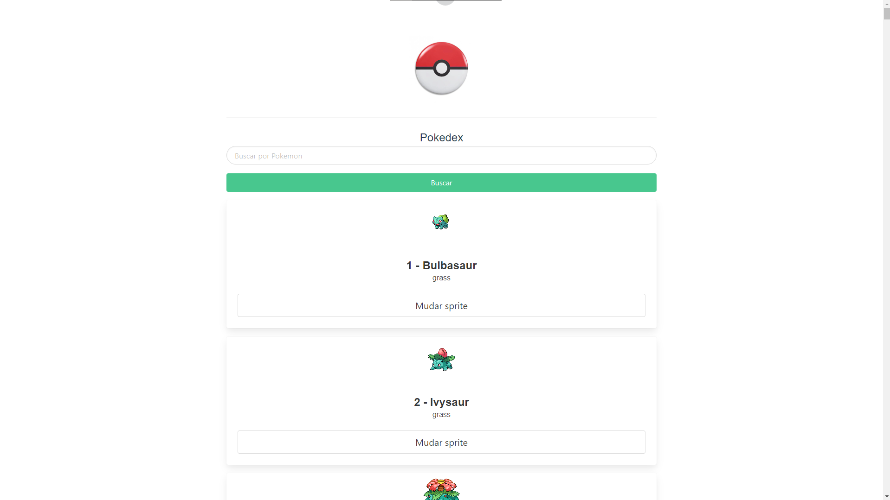

# Pokedex

Criando uma pokedex consumindo API do site do Pokemon para o meu front-end com Vue

# Recursos

* O aplicativo foi desenvolvido com JavaScrip, CSS, HTML, Vue, Bulma.

# Uso

1. Clone o repositório do GitHub.
2. Abra o projeto no seu editor de código.
3. Instale o pacote do projeto com npm install.
4. Depois de instalado os pacotes, basta dar um npm run serve para iniciar o projeto na porta localhost:8080.

# Créditos

Este projeto foi criado por Alaska Websites.